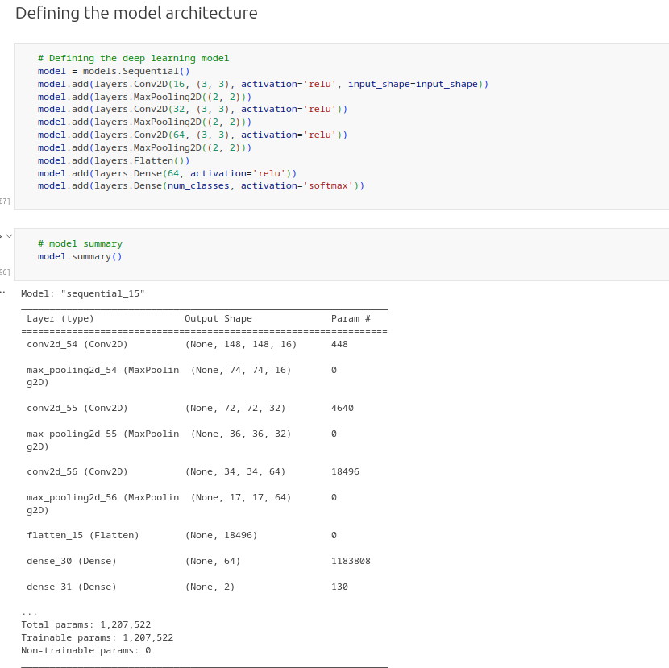

# Deep Learning Classifier Report

## Introduction

In this task, some of the major libraries used include tensorflow and scikit-learn. Tensorflow is used for building and training machine learning models. For this task, scikit-learn was used to provide various modules such as support vector machine (SVM). This module provides support vector machine algorithms that were used in the task.
The deep learning classifier was developed using convolutional neural networks and support vector machines. The convolutional neural network had a total of nine layers. These layers mainly included the main layers, which are Conv2D, MaxPooling2D, Flatten, and Dense layers. Furthermore, the number of layers was determined through experimentation in which the best layers were chosen through the model accuracy and computational efficiency. Similarly, the batch size, learning rate, and other hyperparameters were all chosen through the experimentation method. In this case, the hyperparameters were adjusted according to the accuracy of the results.

## Analysis

For the training, testing, and validation of the classifier, the Dogs and Cats dataset was used. The dataset contains images of dogs and cats. The training dataset contained a total of 1024 images, while the validation dataset contained a total of 512 images. The testing dataset contained a total of 128 images. The main aim of the classifier was to classify an image as either a dog or cat image. Also, a linear SVM was used for this task.
Model Architecture

## Model Training

For the convolutional part of the classifier, the CNN model had an evaluation test accuracy of 0.75. The training accuracy was up to 0.913 while the validation went as high as 0.742. This shows that the model performed well.

## Conclusion

In the case of the SVM model, has an accuracy of 0.578. Typically, the model showed precision and recall zero which could be a result of the extracted data from the CNN model. Typically, it is clear that the CNN model performs quite well, but the data extracted from the results are not that significant, particularly in terms of precision and recall. Overall, the model performed well as observed from the results.
